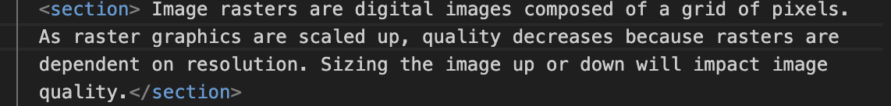
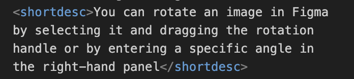
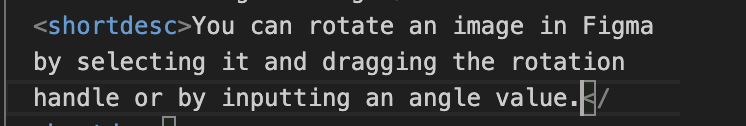

# Plain Language Report
[Plain Language Pull Request:](https://github.com/ENG517/DITA-TM-2/pull/37) 

[Team 2 Style Guide Template](https://docs.google.com/document/d/16Bl6BTj0IVzX7-88ReqUERDiHzsgOgPSj7Crhn7Gmo0/edit?usp=sharing)

* For this unit, we began by making changes based on unit 2 feedback to ensure that all of the topics created were being used in the ditamaps and to make sure all file names were inputted properly so as to get the maps to run successfully. We employed the use of conrefs to the Exporting your Image task topic and scenario 2 ditamap, fixed hyperlinks to follow href conditions, and increased clarity, cohesion, and navigability of the tasks and information needed to complete the steps. 

* When creating the style guide, we first focused on colors that are soft and cohesive while making sure highlighted information would still be emphasized appropriately. To achieve this, we worked with tints from the [NC State expanded palette](https://brand.ncsu.edu/downloads/). Once we found our three colors and the tints we wanted to work with, we looked at different font options. Our goal was to locate readable fonts that looked clean and classic, aligning with our goals for the procedures. We settled on the Roboto Serif font family to achieve both of these goals and included differing levels of headers. For body text, we decided on Archivo font to align with conventions on using serif for headers and sans serif for body text. As a result, we completed a balanced and appealing font and color scheme, aligning with conventions outlined by class lectures and Bellamy et al’s recommendations. 

* Naming conventions for titles to align with Bellamy et al’s parameters for effective titles and headers for each set of topics. For example, we changed “HEX Values” to “HEX Value Codes”, and “design panel” to “design panel applications.” In addition, we changed “grayscale” to “what is grayscale?” and “vectors” to “what are image vectors to practice using cases of questions as headers and titles in guiding the user through steps. 

* We applied bold to minorly emphasize certain words and phrases, like to the prerequisite section of the Create Frame task topic, where we wanted to draw a bit of extra attention without the formality of a full heading. We also utilized the <uicontrol> element to UI-related prompts that had been overlooked in the initial writing, like the ‘M’ key prompt in the Scale Image task topic.

* To avoid syntactic ambiguity, we made sure topics were restated when applicable. Consider the following example in which the topic of **raster** images are restated to provide clarity to a section that may be unclear.

* We also edited out many examples referencing specific locations on the screen or in the Figma UI for the sake of reusability, especially in instances where a table or element in Figma might be in different locations depending on the workspace.

!
* Finally, we went through the topics to look for restrictive referencing cases and reworded them to increase the reuse cases for the information.  We collaborated together over zoom meetings to review and apply changes and corrections to the wording and elements of our topics, and we also wrote our edit log and reflection together during a collaborative meeting. 